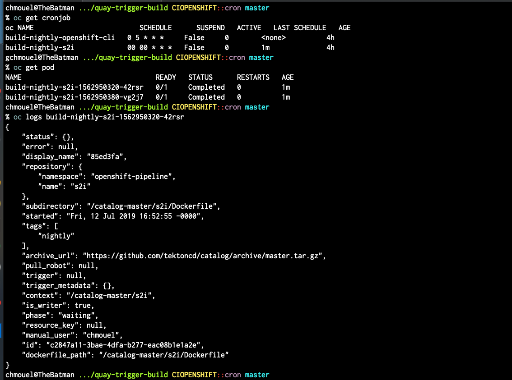

Launch quay repository trigger

This was designed for openshfit catalog to trigger a new build every night from the latest but this can be slurped for some other projects.

It uses quay API and kubernetes cron to periodically kick the job on quay.

## Build this image

You need to access to the quay repo `openshift-pipeline/` or adjust the variable in Makefile and then run :

`make`

it would by default do a `build` and `push`

## Install the CronJob into a K8 cluster

just make sure you have the secret token (makefile would tell you what to do if you haven't) and run :

```
make install
````

adjust the template if you need to do some customization, this is mostly tailored to generate the image for the tekton catalog.

## Demo


